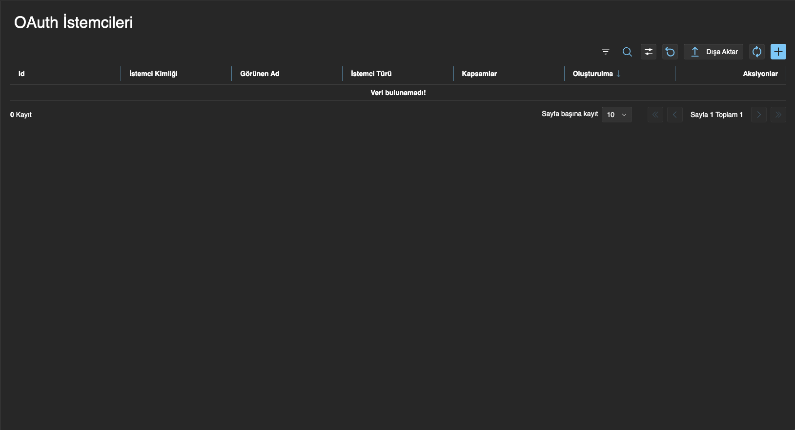
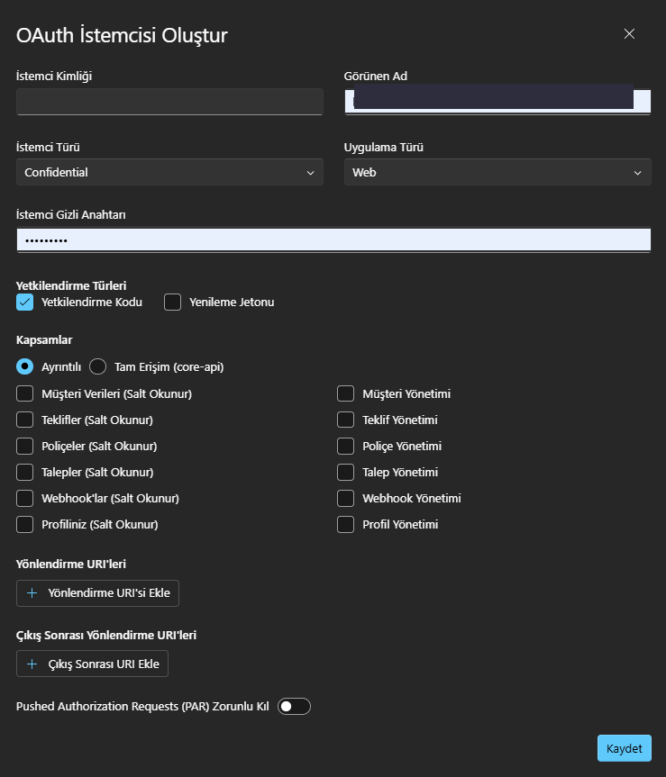

# InsurUp ile Giriş (OAuth 2.0 / OpenID Connect) Entegrasyon Rehberi

Bu rehber, **kendi uygulamanıza "InsurUp ile Giriş" özelliğini eklemek** isteyen ekipler içindir. Kullanıcılar, InsurUp hesaplarıyla (acente kullanıcısı kimlikleriyle) sizin uygulamanıza giriş yapar; uygulamanız da bu kimlikle InsurUp API'sine erişebilir.

İnsan kullanıcı girişi için **OAuth 2.0 Authorization Code + PKCE** akışı kullanılır. Bu, otomasyonlar için kullanılan [Servis Hesabı (M2M)](/entegrasyon/servis-hesabi-olusturma) akışından farklıdır.

| | İnsan Kullanıcı Girişi (bu rehber) | Servis Hesabı (M2M) |
|---|---|---|
| **Amaç** | Kullanıcının InsurUp hesabıyla uygulamaya girişi | Sunucu‑sunucu otomasyon |
| **OAuth akışı** | `authorization_code` + PKCE | `client_credentials` |
| **Kullanıcı etkileşimi** | Var (tarayıcıda giriş + 2FA) | Yok |
| **Token kimi temsil eder?** | Giriş yapan gerçek kullanıcıyı | Servis hesabını |

---

## 1. Mimari: İki ayrı sunucu

InsurUp'ta kimlik doğrulama ile API erişimi **iki farklı sunucuda** yaşar. Entegrasyonun temeli budur:

| Sunucu | Adres | Görevi |
|--------|-------|--------|
| **Kimlik Sunucusu (Auth Server)** | `https://auth.insurup.com` | Giriş, 2FA, OAuth/OIDC token üretimi |
| **Core API** | `https://api.insurup.com` | İş verisi (müşteri, teklif, poliçe…) |

Akış kısaca şöyledir: Kullanıcıyı **auth.insurup.com**'a yönlendirip giriş yaptırırsınız → bir **access token** alırsınız → bu token ile **api.insurup.com**'a istek atarsınız.

:::info Discovery (keşif) ucu
Tüm OIDC uçlarını ve yeteneklerini şu adresten programatik olarak alabilirsiniz:
`https://auth.insurup.com/.well-known/openid-configuration`
:::

### OIDC uçları

| Uç | Adres |
|----|-------|
| Authorization | `https://auth.insurup.com/connect/authorize` |
| Token | `https://auth.insurup.com/connect/token` |
| UserInfo | `https://auth.insurup.com/connect/userinfo` |
| Logout (end session) | `https://auth.insurup.com/connect/logout` |
| Logout (alias) | `https://auth.insurup.com/connect/end-session` |
| Introspection | `https://auth.insurup.com/connect/introspect` |
| Revocation | `https://auth.insurup.com/connect/revoke` |
| PAR (Pushed Authorization) | `https://auth.insurup.com/connect/par` |
| Discovery | `https://auth.insurup.com/.well-known/openid-configuration` |

:::tip JWKS (JSON Web Key Set)
JWKS ayrı bir sabit uçta sunulmaz. JWKS URI'sini discovery belgesi (`/.well-known/openid-configuration`) içindeki `jwks_uri` alanından alın.
:::

:::warning ROPC (şifre grant'i) desteklenmez
Auth Server yalnızca `authorization_code`, `refresh_token` ve `client_credentials` grant türlerini destekler. **`password` grant'i yoktur.** Yani "kullanıcı adı + şifreyi arka planda API'ye gönderip token al" şeklinde, ekran değiştirmeden sessiz bir giriş **mümkün değildir.** Kullanıcı girişi her zaman auth.insurup.com'a yönlendirme (redirect) ile yapılır; 2FA da o sayfada işlenir.
:::

---

## 2. Adım 1 — OAuth İstemcisi (Client) Oluşturma

Entegrasyona başlamadan önce uygulamanız için bir **OAuth istemcisi** tanımlamanız gerekir. Bunu CRM (Agent Panel) üzerinden self‑servis yaparsınız.

:::info OAuth istemcisi globaldir
İstemciyi herhangi bir acentenin paneli üzerinden oluşturursunuz, ancak istemci **acente bazlı değil, globaldir.** Yani **tek bir istemci** ile **farklı acentelerin** InsurUp kullanıcıları uygulamanıza giriş yapabilir. Her acente/uygulama için ayrı ayrı istemci oluşturmanız gerekmez — uygulamanız için bir istemci yeterlidir.
:::

Sol menüden **OAuth İstemcileri** (OAuth Clients) sayfasını açın. Sağ üstteki **mavi `+` butonuna** tıklayın.



Açılan **"OAuth İstemcisi Oluştur"** formunu doldurun:



| Alan | Açıklama | Öneri |
|------|----------|-------|
| **İstemci Kimliği (Client Id)** | İstemcinin benzersiz kimliği | `firma-portal` gibi anlamlı bir değer |
| **Görünen Ad** | Listede görünen ad | `Firma Portalı` |
| **İstemci Türü** | `Public` veya `Confidential` | SPA için **Public**; sunucu/BFF için **Confidential** (bkz. [Uygulama Desenleri](/entegrasyon/insurup-ile-giris-uygulama-desenleri-ve-sorun-giderme)) |
| **Uygulama Türü** | `Web` veya `Native` | Tarayıcı uygulamaları için **Web** |
| **İstemci Gizli Anahtarı (Secret)** | Yalnızca Confidential için | Boş bırakırsanız üretilir; **sadece sunucuda** saklayın |
| **Yetkilendirme Türleri** | `Yetkilendirme Kodu` + `Yenileme Jetonu` | İkisini de işaretleyin (oturum yenileme için Refresh Token gerekir) |
| **Kapsamlar (Scopes)** | İstemcinin erişebileceği API alanları | **En az bir tane zorunlu** (aşağıya bakın) |
| **Yönlendirme URI'leri (Redirect URIs)** | Giriş sonrası dönülecek callback adres(ler)iniz | Hem prod hem geliştirme adreslerini ekleyin |
| **Çıkış Sonrası URI'leri** | `/connect/logout` sonrası dönüş | İsteğe bağlı |
| **PAR Zorunlu Kıl** | Pushed Authorization Requests | Genelde kapalı bırakın |

:::tip Redirect URI'leri
Callback adresinizi tam ve birebir ekleyin (ör. `https://app.firmaniz.com/api/auth/callback`). Geliştirme için `http://localhost:3000/api/auth/callback` gibi adresleri de ekleyin. Eşleşmeyen bir `redirect_uri` ile authorize isteği **400** ile reddedilir.
:::

Kaydettiğinizde `client_id` (ve Confidential ise `client_secret`) elde edersiniz.

:::danger Client Secret bir kez gösterilir
Confidential istemcide secret yalnızca bir kez görünür/üretilir. **Tarayıcıya (SPA'ya) asla koymayın** — yalnızca kendi sunucunuzda saklayın.
:::

---

## 3. Kapsamlar (Scopes)

`scope`, alacağınız token'ın hangi API alanlarına erişebileceğini belirler. Giriş akışında en azından şunları istersiniz: `openid profile offline_access` + erişmek istediğiniz API kapsamları.

| Kapsam | Anlamı |
|--------|--------|
| `openid` | OIDC kimlik token'ı |
| `profile`, `email` | Kullanıcı profil/e‑posta bilgileri |
| `offline_access` | **Refresh token** alabilmek için (oturum yenileme) |
| `core-api` | Core API'ye **tam erişim** |
| `customer:read` / `customer:write` | Müşteri okuma/yönetimi |
| `proposal:read` / `proposal:write` | Teklif okuma/yönetimi |
| `policy:read` / `policy:write` | Poliçe okuma/yönetimi |
| `case:read` / `case:write` | Talep okuma/yönetimi |
| `webhook:read` / `webhook:write` | Webhook okuma/yönetimi |
| `me:read` / `me:write` | Kendi profil bilgisi |

:::info Kapsam seçim modları
Oluşturma formunda iki mod bulunur:
- **Granüler (İnce Taneli):** Yukarıdaki `resource:action` kapsamlarını teker teker seçersiniz.
- **Tam Erişim:** `core-api` kapsamını otomatik olarak atar ve tüm API'ye erişim sağlar.

`core-api` ile granüler kapsamlar birlikte kullanılamaz — ikisinden birini seçin.
:::

---

## 4. Adım 2 — Authorization Code + PKCE Akışı

1. **PKCE üretin:** Rastgele bir `code_verifier` oluşturun, SHA‑256 ile `code_challenge` türetin (`code_challenge_method=S256`). Ayrıca CSRF için bir `state` üretin.
2. **Kullanıcıyı authorize ucuna yönlendirin:**

```
https://auth.insurup.com/connect/authorize
  ?response_type=code
  &client_id=<CLIENT_ID>
  &redirect_uri=<KAYITLI_CALLBACK_ADRESINIZ>
  &scope=openid profile offline_access core-api
  &state=<STATE>
  &code_challenge=<CHALLENGE>
  &code_challenge_method=S256
```

3. Kullanıcı **auth.insurup.com** üzerinde giriş yapar (gerekirse 2FA/SMS burada işlenir).
4. Auth Server, kullanıcıyı `redirect_uri`'nize `?code=...&state=...` ile geri yönlendirir. `state`'i doğrulayın.
5. **Code'u token'a çevirin** (`/connect/token`, `application/x-www-form-urlencoded`):

```
grant_type=authorization_code
code=<CODE>
redirect_uri=<AYNI_CALLBACK_ADRESI>
client_id=<CLIENT_ID>
code_verifier=<VERIFIER>
# Confidential istemcide ek olarak:
client_secret=<SECRET>
```

6. Yanıt:

```json
{
  "access_token": "eyJhbGciOiJSUzI1NiIs...",
  "refresh_token": "...",
  "expires_in": 600,
  "token_type": "Bearer"
}
```

:::tip Oturum yenileme
`access_token` kısa ömürlüdür. `offline_access` ile aldığınız `refresh_token`'ı kullanarak `grant_type=refresh_token` ile yeni access token alın. Refresh token'ı **güvenli** saklayın (tercihen sunucuda; bkz. BFF deseni).
:::

---

## 5. Adım 3 — Token ile API Çağrısı

Aldığınız `access_token` ile `https://api.insurup.com` üzerindeki uçlara `Authorization: Bearer <token>` başlığıyla istek atın. API, token içindeki kullanıcıyı çözüp ilgili acente/kullanıcı bağlamında yanıt verir.

### Resmi SDK ile (önerilen)

`@insurup/sdk` (InsurUp TypeScript SDK), token'ı bir `tokenProvider` ile alır:

```typescript
import { DefaultInsurUpClient } from '@insurup/sdk';

const client = new DefaultInsurUpClient({
  baseUrl: 'https://api.insurup.com',
  tokenProvider: () => getAccessToken(), // geçerli access token'ı döndüren fonksiyonunuz
});

const result = await client.customers.getCustomers({ first: 10 });
if (result.isSuccess) {
  console.log(result.data.nodes);
}
```

### Doğrulama uçları

| Method | Endpoint | Beklenen |
|--------|----------|----------|
| `GET` | `https://auth.insurup.com/connect/userinfo` | Kullanıcı bilgileri |
| `GET` | `https://api.insurup.com/api/agent-users/me` | Giriş yapan kullanıcının profili |

---

## 6. Sonraki adım

Uygulama tipinize göre (tarayıcı SPA mı, sunucu/BFF mi) hazır deseni, örnek kodu ve en sık karşılaşılan sorunların çözümünü şu rehberde bulabilirsiniz:

➡️ [**InsurUp ile Giriş: Uygulama Desenleri ve Sorun Giderme**](/entegrasyon/insurup-ile-giris-uygulama-desenleri-ve-sorun-giderme)
