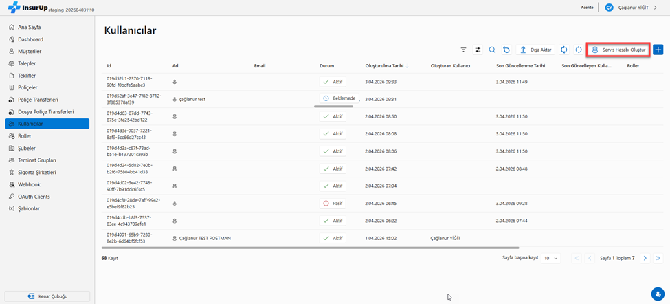
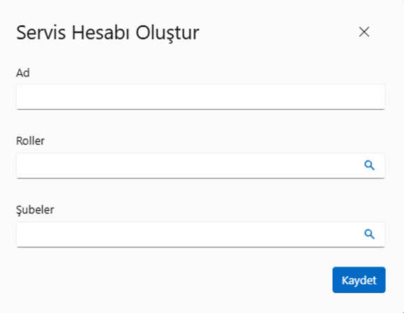
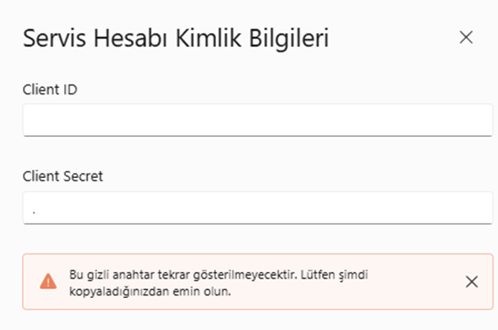

# Servis Hesabı Oluşturma ve Kullanım Kılavuzu

## 1. Servis Hesabı Nedir?

Servis hesabı, bir insan kullanıcı yerine bir yazılımın veya otomasyonun API'ye erişmesini sağlayan özel bir hesap türüdür. Örneğin her gece otomatik müşteri senkronizasyonu yapan bir script, servis hesabı kullanarak InsurUp API'sine bağlanır.

**Normal kullanıcı girişinden farkı:**

| | Normal Kullanıcı | Servis Hesabı |
|---|---|---|
| **Kimlik doğrulama** | Tarayıcıdan kullanıcı adı + şifre ile giriş | Client ID + Secret ile otomatik token alma |
| **İnsan müdahalesi** | Gerekli | Gerekli değil |
| **Kullanım amacı** | Manuel panel erişimi | Otomasyon & entegrasyon |

---

## 2. Servis Hesabı Oluşturma

### 2.1 Ön Koşul

Agent Panel'e giriş yapmış olmanız gerekiyor. Sol menüden **"Kullanıcılar"** sayfasını açın.

### 2.2 Adımlar

**1.** Kullanıcılar sayfasında **"Servis Hesabı Oluştur"** butonuna tıklayın.



**2.** Açılan formda şu alanları doldurun:

| Alan | Açıklama | Örnek |
|------|----------|-------|
| **Ad** | Hesabın amacını belirten bir isim | `entegrasyon-botu`, `muhasebe-sync` |
| **Roller** | Hesabın yetkisini belirleyen rol | İlgili rolü seçin |
| **Şubeler** | Gerekiyorsa ilgili şube | İlgili şubeyi seçin |



**3.** **"Kaydet"** butonuna basın.

**4.** Ekranda **Client ID** ve **Client Secret** gösterilecektir.



:::danger DİKKAT
**Client Secret sadece bu ekranda bir kez gösterilir.** Dialog kapatıldıktan sonra bir daha erişilemez. Hemen güvenli bir yere kopyalayın!
:::

### 2.3 Oluşturma Sonrası Kontrol

Dialog kapatıldıktan sonra kullanıcı listesine dönün. Oluşturduğunuz servis hesabı:

- Listede **bot/robot ikonu** ile görünecektir (insan kullanıcılar kişi ikonu ile gösterilir)
- İsim sütununda **ServiceAccountName** yazar (FirstName + LastName değil)

---

## 3. Token Alma (M2M Authentication)

Servis hesabınızı oluşturduktan sonra bu hesapla API'ye erişmek için önce bir **token** almanız gerekir. Bu işlem Postman veya curl ile yapılır (tarayıcıdan yapılamaz).

### 3.1 Auth Server Adresini Bulma

Token almak için isteği **API adresine değil**, **Auth Server adresine** göndermeniz gerekir. Bu iki farklı sunucudur:

| Sunucu | Adres Örneği |
|--------|--------------|
| API | `https://api.insurup.com` |
| Auth Server | `https://auth.insurup.com/connect/token` |

:::warning Önemli
Token isteğini API adresine gönderirseniz `404 Not Found` hatası alırsınız. Auth Server adresini kullandığınızdan emin olun.
:::

### 3.2 Postman ile Token Alma

1. Postman'de yeni bir istek oluşturun. **Method: POST**
2. URL olarak Auth Server adresini yazın: `https://auth.insurup.com/connect/token`
3. **Body** sekmesinde **"x-www-form-urlencoded"** seçin
4. Aşağıdaki değerleri ekleyin:

| Key | Value |
|-----|-------|
| `grant_type` | `client_credentials` |
| `client_id` | *(Servis hesabı oluştururken aldığınız Client ID)* |
| `client_secret` | *(Kopyaladığınız Secret)* |
| `scope` | `core-api` |

5. **"Send"** butonuna basın.

### 3.3 Başarılı Yanıt

Doğru bilgilerle gönderdiğinizde şuna benzer bir yanıt alacaksınız:

```json
{
  "access_token": "eyJhbGciOiJSUzI1NiIs...",
  "expires_in": 3600,
  "token_type": "Bearer",
  "scope": "core-api"
}
```

:::tip
**`access_token`** değerini kopyalayın — API çağrılarında kullanacaksınız.
:::

### 3.4 Hatalı Durumlar

| Durum | HTTP Kodu | Anlamı |
|-------|-----------|--------|
| Yanlış secret | `401 Unauthorized` | Secret hatalı |
| Yanlış URL (API adresine gönderme) | `404 Not Found` | Auth Server'a gönderin |
| Tarayıcıdan açma | Antiforgery hatası | Postman kullanın |

---

## 4. Token ile API Çağrısı Yapma

Aldığınız token ile artık InsurUp API'sine istek atabilirsiniz.

### 4.1 Her İstekte Yapılacak

Postman'de **Headers** sekmesine şu değeri ekleyin:

| Key | Value |
|-----|-------|
| `Authorization` | `Bearer eyJhbGciOiJ...` *(tokenın tamamı)* |

### 4.2 Test Edilecek Endpoint'ler

| Method | Endpoint | Beklenen Sonuç |
|--------|----------|----------------|
| `GET` | `/agent-users/me` | `200 OK` — `isServiceAccount: true` dönmeli |
| `POST` | `/customers` | `200 OK` — müşteri oluşturulmalı |
| `GET` | `/customers/{id}` | `200 OK` — kendi müşterinizi çekin |
| `GET` | `/customers/{başka-agent-id}` | `404 Not Found` — farklı agent'ın verisi |
| `GET` | `/proposals` | `200 OK` — rolünüze göre veri döner |

---

## 5. Servis Hesabını Yönetme

### 5.1 Devre Dışı Bırakma

Agent Panel > Kullanıcılar sayfasından servis hesabını **"Deactivate"** edin.

1. Hesap durumu **Inactive** olur.
2. Bu hesabın tokenı ile API'ye istek atılırsa **`403 Forbidden`** döner.
3. Tekrar **"Activate"** ederseniz, aynı secret ile token alabilirsiniz (secret değişmez).

### 5.2 Silme

Servis hesabını tamamen sildiğinizde:

1. Hem kullanıcı hem OAuth uygulaması silinir.
2. Eski token ile istek atılırsa **`401 Unauthorized`** döner.
3. **Bu işlem geri alınamaz.**

:::danger DİKKAT
Silme işlemi geri alınamaz. Silmeden önce bu hesabı kullanan entegrasyonların olmadığından emin olun.
:::

---

## 6. Sık Karşılaşılan Hatalar

| Hata | Sebebi | Çözümü |
|------|--------|--------|
| `404` — Endpoint Bulunamadı | Token isteği API adresine gönderilmiş | URL'i Auth Server adresi ile değiştirin |
| Antiforgery Token hatası | `/connect/token` tarayıcıdan açılmış | Tarayıcı yerine Postman veya curl kullanın |
| `401` — Unauthorized | Yanlış secret veya silinmiş hesap | Secret'i kontrol edin, hesabın aktif olduğunu doğrulayın |
| `403` — Forbidden | Hesap devre dışı (Inactive) | Hesabı Agent Panel'den tekrar aktif edin |
| `404` — Müşteri bulunamadı | Farklı agent'ın müşterisi sorgulanmış | Sadece kendi agent'ınıza ait müşterilere erişebilirsiniz |

---

## 7. Hızlı Kontrol Listesi

Test sürecinde aşağıdaki maddeleri sırayla takip edin:

- [ ] Agent Panel'e giriş yapıldı mı?
- [ ] Servis hesabı oluşturuldu mu?
- [ ] Client ID ve Secret kopyalandı mı?
- [ ] Auth Server adresi doğru mu? *(API adresi değil!)*
- [ ] Postman'de POST isteği `x-www-form-urlencoded` ile mi gönderildi?
- [ ] Token başarıyla alındı mı?
- [ ] API çağrılarında `Authorization: Bearer {token}` eklendi mi?
- [ ] `/agent-users/me` çağrısında `isServiceAccount: true` dönüyor mu?
