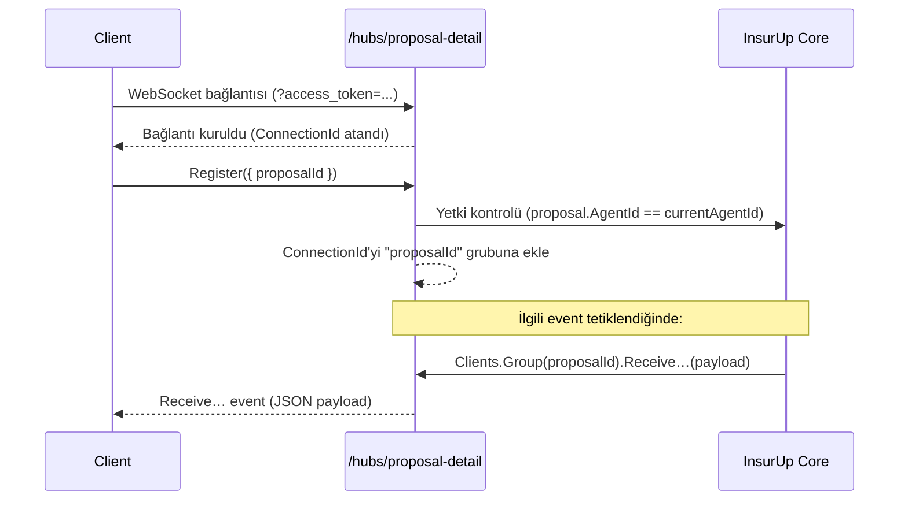

# SignalR Entegrasyonu

InsurUp, teklif (proposal) ürünlerinin yaşam döngüsündeki anlık (real‑time) durum değişikliklerini istemcilere ulaştırmak için **SignalR** kullanır. Webhook'lar sunucudan sunucuya **kalıcı** (durable) bildirim akışı sağlarken, SignalR aynı bilgileri **etkileşimli kullanıcı arayüzlerine** (ör. teklif detay sayfası) milisaniyeler içinde ileten **anlık** bir kanaldır.

:::info Tek Hub
Şu anda tek bir hub yayında: **`/hubs/proposal-detail`**. Teklif ürünlerinin prim alma, revize, satın alma ve kapsam (coverage) güncelleme aşamalarındaki tüm durum geçişlerini bu hub üzerinden alabilirsiniz.
:::

## Hub Adresi ve Taşıma

| Özellik | Değer |
|---------|-------|
| **Hub URL** | `{API_BASE_URL}/hubs/proposal-detail` |
| **Protokol** | SignalR (WebSocket tercih edilir, fallback olarak SSE/long‑polling) |
| **Backplane** | Redis (StackExchange.Redis) — çoklu sunucu instance'ları arasında event yayını dağıtık çalışır |
| **Kimlik Doğrulama** | OIDC/Bearer token, `access_token` query string parametresi olarak |
| **Yetki Politikası** | `AgentUser` — yalnızca acente tipi kullanıcı token'ları kabul edilir |

:::tip Token'ı Query String'de Gönderme
SignalR'ın WebSocket handshake'i sırasında tarayıcı `Authorization` header'ı gönderemediği için token, hub URL'ine query string parametresi olarak eklenir. Sunucu tarafında bir middleware, `/hubs/*` ile başlayan istekler için `access_token` query parametresini otomatik olarak `Authorization: Bearer …` header'ına dönüştürür.
:::

## Bağlantı Akışı



1. İstemci, geçerli bir OIDC access token ile hub'a bağlanır.
2. İlgileneceği teklifin `proposalId`'sini `Register` metoduna gönderir.
3. Sunucu, teklifin gerçekten bu kullanıcının acentesine ait olduğunu doğrular; uygunsa bağlantıyı `proposalId` adlı SignalR **grubuna** ekler.
4. Bundan sonra ilgili teklife dair tüm event'ler bu istemciye iletilir.

:::warning Yetkisiz / Yanlış Tenant
`Register` çağrısı, teklif mevcut değilse veya `proposal.AgentId` ile çağıran kullanıcının `AgentId`'si eşleşmiyorsa **sessizce başarısız olur** (grup'a eklenmez, hata fırlatılmaz). İstemcide event gelmiyorsa önce token'ın doğru tenant'a ait olduğunu kontrol edin.
:::

## Hub Metodu: `Register`

Bağlantı kurulduktan sonra çağrılması gereken tek client→server metodu.

| Parametre | Tip | Zorunlu | Açıklama |
|-----------|-----|:-------:|----------|
| `proposalId` | `string` | ✅ | Olayları dinlemek istediğiniz teklifin ID'si |

**Çağrı şekli (.NET):**

```csharp
await hubConnection.SendAsync("Register", new { ProposalId = "65f1a2b3c4d5e6f7a8b9c0d1" });
```

**Çağrı şekli (JavaScript):**

```javascript
await connection.invoke("Register", { proposalId: "65f1a2b3c4d5e6f7a8b9c0d1" });
```

---

## Event Özeti

`/hubs/proposal-detail` üzerinden istemciye 8 farklı event yayınlanır. Tümü `ReceiveProposalProductBase` ortak alanlarını taşır (aşağıdaki "Ortak Alanlar" bölümüne bakın); bazılarının ek alanları vardır.

| Event | Ne Zaman Tetiklenir? | Tetikleyen |
|-------|----------------------|------------|
| **`ReceiveProposalProductInProgress`** | Başarısız bir ürün için yeniden deneme (retry) başlatıldığında | `RetryFailedProposalProduct` |
| **`ReceiveProposalProductSuccess`** | Sigorta şirketinden prim hesabı başarıyla alındığında | `ProposalProductPremiumReceived` integration event'i |
| **`ReceiveProposalProductFailed`** | Prim hesabı başarısız olduğunda veya boş prim listesi döndüğünde | `ProposalProductPremiumReceived` integration event'i |
| **`ReceiveProposalProductCoverage`** | Teklif dokümanındaki PDF kapsamı (coverage) asenkron olarak çıkarılıp güncellendiğinde | `ProposalProductCoverageReceived` integration event'i |
| **`ReceiveProposalProductRevised`** | Teklif ürünü yeni bir kapsamla revize edildiğinde | `ReviseProposalProduct` |
| **`ReceiveProposalProductPurchasing`** | Satın alma akışı başlatıldığında (poliçe oluşturma çağrısından hemen önce) | `PurchaseProposalProductSync`, `PurchaseProposalProductAsync` |
| **`ReceiveProposalProductPurchased`** | Poliçe başarıyla oluşturulduğunda | `PurchaseProposalProductSync`, `AsyncPolicyCreationResponded` |
| **`ReceiveProposalProductPurchaseFailed`** | Poliçe oluşturma başarısız olduğunda (sync exception veya async hata cevabı) | `PurchaseProposalProductSync`, `PurchaseProposalProductAsync`, `AsyncPolicyCreationResponded` |

### Tipik Yaşam Döngüsü

```
Teklif oluşturuldu
   │
   ▼
ReceiveProposalProductSuccess   ← prim alındı (her ürün için ayrı ayrı)
   │
   ▼  (opsiyonel) ReceiveProposalProductCoverage   ← PDF kapsamı geldi
   │
   ▼  (opsiyonel) ReceiveProposalProductRevised    ← kapsam revize edildi
   │
   ▼
ReceiveProposalProductPurchasing  ← satın alma başladı
   │
   ├── başarılı  ──▶  ReceiveProposalProductPurchased
   └── başarısız ──▶  ReceiveProposalProductPurchaseFailed
```

Başarısız prim akışında:

```
ReceiveProposalProductFailed
   │  (kullanıcı "tekrar dene" der)
   ▼
ReceiveProposalProductInProgress
   │
   ▼
ReceiveProposalProductSuccess   (veya tekrar Failed)
```

---

## Ortak Alanlar (`ReceiveProposalProductBase`)

Aşağıdaki alanlar `ReceiveProposalProductCoverage` **hariç** tüm event'lerde bulunur:

| Alan | Tip | Zorunlu | Açıklama |
|------|-----|:-------:|----------|
| `proposalId` | `string` | ✅ | Teklif ID'si |
| `proposalProductId` | `string` | ✅ | Teklif ürünü ID'si |
| `productId` | `int` | ✅ | Sigorta ürün ID'si |
| `productName` | `string` | ✅ | Ürün adı |
| `productType` | `InsuranceProductType` | ✅ | Ürün tipi (enum) |
| `insuranceCompanyId` | `int` | ✅ | Sigorta şirketi ID'si |
| `insuranceCompanyName` | `string` | ✅ | Sigorta şirketi adı |
| `insuranceCompanyLogo` | `string?` | ❌ | Sigorta şirketi logosu (URL) |
| `supportedPaymentOptions` | `PaymentOption[]` | ✅ | Şirketin desteklediği ödeme seçenekleri |

---

## Event Detayları

### `ReceiveProposalProductInProgress`

Sadece **ortak alanları** içerir. Başarısız bir ürün için `RetryFailedProposalProduct` çağrıldığında yayınlanır; UI bu event ile ürünü "yükleniyor" durumuna çevirebilir.

```json
{
  "proposalId": "65f1a2b3c4d5e6f7a8b9c0d1",
  "proposalProductId": "65f1a2b3c4d5e6f7a8b9c0d2",
  "productId": 40235,
  "productName": "Kasko Plus",
  "productType": "KASKO",
  "insuranceCompanyId": 12,
  "insuranceCompanyName": "Örnek Sigorta",
  "insuranceCompanyLogo": "https://cdn.insurup.com/logos/ornek.png",
  "supportedPaymentOptions": ["CREDIT_CARD", "OPEN_ACCOUNT"]
}
```

---

### `ReceiveProposalProductSuccess`

Prim hesabı başarıyla alındığında tetiklenir. Ortak alanlara **ek olarak**:

| Alan | Tip | Zorunlu | Açıklama |
|------|-----|:-------:|----------|
| `needsInvestigationByCompany` | `bool` | ✅ | Şirket incelemesi gerektiriyor mu? |
| `investigationMessage` | `string?` | ❌ | İnceleme açıklaması |
| `hasVocationalDiscount` | `bool` | ✅ | Meslek indirimi uygulandı mı? |
| `hasUndamagedDiscount` | `bool` | ✅ | Hasarsızlık indirimi uygulandı mı? |
| `hasUndamagedDiscountRate` | `decimal?` | ❌ | Hasarsızlık indirim oranı (%) |
| `premiums` | `PremiumModel[]` | ✅ | Taksit alternatifleri |
| `insuranceServiceProviderCoverage` | `Coverage?` | ❌ | Sigorta şirketinin döndürdüğü kapsam |
| `pdfCoverage` | `Coverage?` | ❌ | Teklif PDF'inden çıkarılan kapsam |
| `initialCoverage` | `Coverage?` | ❌ | İlk istenen (initial) kapsam |
| `optimalCoverage` | `Coverage?` | ❌ | Optimal (önerilen) kapsam |

**`PremiumModel`:**

| Alan | Tip | Zorunlu | Açıklama |
|------|-----|:-------:|----------|
| `installmentNumber` | `int` | ✅ | Taksit sayısı (1, 3, 6, 9, 12, …) |
| `insurancePremiumReference` | `Guid` | ✅ | Şirket tarafındaki prim referansı (satın almada kullanılır) |
| `netPremium` | `decimal` | ✅ | Net prim |
| `grossPremium` | `decimal` | ✅ | Brüt prim (vergiler dahil) |
| `commission` | `decimal` | ✅ | Acente komisyonu |
| `exchangeRate` | `decimal` | ✅ | Kur (TL dışı para birimleri için) |
| `currency` | `Currency` | ✅ | Para birimi (enum) |
| `insuranceCompanyProposalNumber` | `string?` | ❌ | Şirketin teklif numarası |

---

### `ReceiveProposalProductFailed`

Prim hesabı başarısız olduğunda tetiklenir. Ortak alanlara **ek olarak**:

| Alan | Tip | Zorunlu | Açıklama |
|------|-----|:-------:|----------|
| `errorMessage` | `string?` | ❌ | Şirketten gelen veya sistem tarafından üretilen hata mesajı |

```json
{
  "proposalId": "65f1a2b3c4d5e6f7a8b9c0d1",
  "proposalProductId": "65f1a2b3c4d5e6f7a8b9c0d2",
  "productId": 40235,
  "productName": "Kasko Plus",
  "productType": "KASKO",
  "insuranceCompanyId": 12,
  "insuranceCompanyName": "Örnek Sigorta",
  "insuranceCompanyLogo": null,
  "supportedPaymentOptions": ["CREDIT_CARD"],
  "errorMessage": "Aracın model yılı şirket kuralları dışında."
}
```

---

### `ReceiveProposalProductCoverage`

Teklif PDF'i asenkron olarak işlendiğinde gelen kapsam güncellemesi. **Bu event ortak alanları içermez**, yalnızca aşağıdaki alanlara sahiptir:

| Alan | Tip | Zorunlu | Açıklama |
|------|-----|:-------:|----------|
| `proposalId` | `string` | ✅ | Teklif ID'si |
| `proposalProductId` | `string` | ✅ | Teklif ürünü ID'si |
| `pdfCoverage` | `Coverage?` | ❌ | PDF'ten çıkarılan kapsam |
| `optimalCoverage` | `Coverage?` | ❌ | PDF kapsamı uygulandıktan sonra yeniden hesaplanan optimal kapsam |
| `hasVocationalDiscount` | `bool?` | ❌ | PDF'ten okunan meslek indirimi |
| `hasUndamagedDiscount` | `bool?` | ❌ | PDF'ten okunan hasarsızlık indirimi |
| `hasUndamagedDiscountRate` | `decimal?` | ❌ | PDF'ten okunan hasarsızlık indirim oranı |

:::info Coverage Sırası
`ReceiveProposalProductSuccess` event'i geldiğinde `pdfCoverage` `null` olabilir; çünkü PDF asenkron olarak indirilip parse ediliyor. PDF işlendikten sonra `ReceiveProposalProductCoverage` ile güncel kapsam ayrı bir event olarak gönderilir.
:::

---

### `ReceiveProposalProductRevised`

`ReviseProposalProduct` request handler'ı bir ürünün kapsamını değiştirdiğinde tetiklenir. Yalnızca **ortak alanları** içerir.

---

### `ReceiveProposalProductPurchasing`

Satın alma akışı başlatıldığında (poliçe sigorta şirketine gönderilmeden hemen önce) yayınlanır. Yalnızca **ortak alanları** içerir. UI bu event ile ödeme/yükleme ekranını gösterebilir.

---

### `ReceiveProposalProductPurchased`

Poliçe başarıyla oluşturulduğunda tetiklenir. Ortak alanlara **ek olarak**:

| Alan | Tip | Zorunlu | Açıklama |
|------|-----|:-------:|----------|
| `policyId` | `string` | ✅ | Oluşturulan poliçenin InsurUp ID'si |

```json
{
  "proposalId": "65f1a2b3c4d5e6f7a8b9c0d1",
  "proposalProductId": "65f1a2b3c4d5e6f7a8b9c0d2",
  "productId": 40235,
  "productName": "Kasko Plus",
  "productType": "KASKO",
  "insuranceCompanyId": 12,
  "insuranceCompanyName": "Örnek Sigorta",
  "insuranceCompanyLogo": "https://cdn.insurup.com/logos/ornek.png",
  "supportedPaymentOptions": ["CREDIT_CARD"],
  "policyId": "65f1a2b3c4d5e6f7a8b9c0d3"
}
```

---

### `ReceiveProposalProductPurchaseFailed`

Satın alma başarısız olduğunda tetiklenir (3D Secure reddi, şirket hatası, ödeme reddi vs.). Ortak alanlara **ek olarak**:

| Alan | Tip | Zorunlu | Açıklama |
|------|-----|:-------:|----------|
| `errorMessage` | `string?` | ❌ | Hata mesajı (sync exception path'inde `null` olabilir) |

---

## İstemci Örnekleri

### JavaScript / TypeScript

`@microsoft/signalr` paketini kullanarak:

```bash
npm install @microsoft/signalr
```

```typescript
import * as signalR from "@microsoft/signalr";

const accessToken = await getAccessToken(); // OIDC token'ınızı edinin

const connection = new signalR.HubConnectionBuilder()
    .withUrl(`https://api.insurup.com/hubs/proposal-detail?access_token=${accessToken}`, {
        transport: signalR.HttpTransportType.WebSockets,
        skipNegotiation: true,
    })
    .withAutomaticReconnect()
    .configureLogging(signalR.LogLevel.Information)
    .build();

// Event handler'ları KONEXTİYON BAŞLATILMADAN ÖNCE register edin
connection.on("ReceiveProposalProductSuccess", (model) => {
    console.log("Prim alındı:", model);
});

connection.on("ReceiveProposalProductFailed", (model) => {
    console.warn("Prim alınamadı:", model.errorMessage);
});

connection.on("ReceiveProposalProductInProgress",   (m) => { /* … */ });
connection.on("ReceiveProposalProductRevised",      (m) => { /* … */ });
connection.on("ReceiveProposalProductCoverage",     (m) => { /* … */ });
connection.on("ReceiveProposalProductPurchasing",   (m) => { /* … */ });
connection.on("ReceiveProposalProductPurchased",    (m) => { /* … */ });
connection.on("ReceiveProposalProductPurchaseFailed", (m) => { /* … */ });

await connection.start();

// Bağlantı kurulduktan sonra ilgili teklif için kayıt ol
await connection.invoke("Register", { proposalId: "65f1a2b3c4d5e6f7a8b9c0d1" });
```

:::warning Sıralama Önemli
`connection.on(...)` çağrılarını `connection.start()` **öncesinde** yapın; aksi halde bağlantı kurulurken gelen ilk event'leri kaçırabilirsiniz. `invoke("Register", …)` ise `start()` **sonrasında** çağrılmalıdır.
:::

---

### .NET

`Microsoft.AspNetCore.SignalR.Client` paketi ile:

```csharp
using Microsoft.AspNetCore.Http.Connections;
using Microsoft.AspNetCore.Http.Connections.Client;
using Microsoft.AspNetCore.SignalR.Client;
using InsuranceUp.Modules.ProposalManagement.SignalR.Models;

var accessToken = await tokenProvider.GetAccessTokenAsync();

var hubConnection = new HubConnectionBuilder()
    .WithUrl(
        $"https://api.insurup.com/hubs/proposal-detail?access_token={accessToken}",
        options =>
        {
            options.SkipNegotiation = true;
            options.Transports = HttpTransportType.WebSockets;
        })
    .WithAutomaticReconnect()
    .Build();

hubConnection.On<ReceiveProposalProductSuccessModel>("ReceiveProposalProductSuccess",
    model => { /* … */ });

hubConnection.On<ReceiveProposalProductFailedModel>("ReceiveProposalProductFailed",
    model => { /* … */ });

hubConnection.On<ReceiveProposalProductInProgressModel>("ReceiveProposalProductInProgress",
    model => { /* … */ });

hubConnection.On<ReceiveProposalProductRevisedModel>("ReceiveProposalProductRevised",
    model => { /* … */ });

hubConnection.On<ReceiveProposalProductCoverageModel>("ReceiveProposalProductCoverage",
    model => { /* … */ });

hubConnection.On<ReceiveProposalProductPurchasingModel>("ReceiveProposalProductPurchasing",
    model => { /* … */ });

hubConnection.On<ReceiveProposalProductPurchasedModel>("ReceiveProposalProductPurchased",
    model => { /* … */ });

hubConnection.On<ReceiveProposalProductPurchaseFailedModel>("ReceiveProposalProductPurchaseFailed",
    model => { /* … */ });

await hubConnection.StartAsync();

await hubConnection.SendAsync("Register", new RegisterProposalProductHub(proposalId));
```

:::tip Tip Paylaşımı
Model sınıflarını paylaşan modül `InsuranceUp.Modules.ProposalManagement.SignalR.Models` projesinde tanımlıdır. Dış istemcilerde aynı isimde DTO'ları kendiniz tanımlayabilir veya — InsurUp NuGet paketlerine erişiminiz varsa — bu paketi referans alabilirsiniz.
:::

---

## Sunucu Tarafı Mimarisi

Aşağıdaki bilgi, bu projeye yeni katılan **dahili geliştiriciler** içindir. Dış entegratörler için bilgisel düzeydedir.

### Bileşenler

| Dosya | Sorumluluk |
|-------|------------|
| `src/Modules/ProposalManagement/.../Application/Hubs/ProposalDetailHub.cs` | Hub sınıfı, `Register` metodu ve istemci arayüzü `IProposalDetailHubClient` |
| `src/Modules/ProposalManagement/.../SignalR.Models/Receive*.cs` | İstemciye gönderilen 8 event'in payload modelleri |
| `src/Modules/ProposalManagement/.../ServiceRegistry/ProposalModuleConfigurationExtensions.cs` | `app.MapHub<ProposalDetailHub>("/hubs/proposal-detail")` çağrısı |
| `src/Apps/WebApi/.../Program.cs` | `builder.Services.AddSignalR().AddStackExchangeRedis(...)` ve `/hubs/*` için token query→header rewrite middleware'i |

### Event Yayını

Event'ler `IHubContext<ProposalDetailHub, IProposalDetailHubClient>` bağımlılığı üzerinden yayınlanır:

```csharp
await _hubContext.Clients
    .Group(proposal.Id.Value)
    .ReceiveProposalProductSuccess(model);
```

Yayın yapan başlıca yerler:

- **`ProposalProductPremiumReceivedIntegrationEventHandler`** — MassTransit consumer; insurgateway'den prim geldiğinde Success veya Failed yayınlar.
- **`ProposalProductCoverageReceivedIntegrationEventHandler`** — PDF kapsamı işlendikten sonra Coverage yayınlar.
- **`ReviseProposalProductRequestHandler`** — MediatR request handler; revize sonrası Revised yayınlar.
- **`RetryFailedProposalProductRequestHandler`** — InProgress yayınlar.
- **`PurchaseProposalProductSyncRequestHandler`** / **`PurchaseProposalProductAsyncRequestHandler`** — Purchasing yayınlar; sync ayrıca başarı/hata akışında Purchased / PurchaseFailed yayınlar.
- **`AsyncPolicyCreationRespondedIntegrationEventHandler`** — Async poliçe oluşturma cevabı geldiğinde Purchased veya PurchaseFailed yayınlar.

:::info Redis Backplane
WebApi birden fazla instance ile yatay ölçekleniyor. SignalR'ın Redis backplane'i sayesinde, hub'a bir instance üzerinden bağlanan istemci, başka bir instance'tan tetiklenen event'leri de alır. Yapılandırma `Program.cs` içinde:

```csharp
builder.Services.AddSignalR()
    .AddStackExchangeRedis(o => o.Configuration = redisConfigurationOptions);
```
:::

### Grup Stratejisi

Her teklif kendi adıyla (`proposalId`) bir SignalR grubuna karşılık gelir. `Register` çağrısı, bağlantıyı bu gruba ekler. Sunucu, event yayınlarken **`Clients.Group(proposalId)`** kullandığı için yalnızca o teklifin detayına bakan istemciler event alır.

### Tenant İzolasyonu

`ProposalDetailHub.Register` metodunda iki katmanlı kontrol vardır:

1. Token'dan `ICurrentTenantUser.GetAgentIdOrDefault()` ile çağıranın acente ID'si alınır.
2. Veritabanından çekilen `proposal.AgentId` ile karşılaştırılır.

Uyuşmazsa **gruba ekleme yapılmaz**; istemci bağlı kalır ama event almaz. Bu, başka bir acentenin teklifine ait ID tahmin edilse bile event sızıntısını engeller.

---

## SignalR vs. Webhook: Hangisini Kullanmalıyım?

| Senaryo | Önerilen |
|---------|----------|
| Bir kullanıcının açık olduğu teklif detay sayfasında anlık UI güncellemesi | **SignalR** |
| Mobil uygulamada arka plandayken bildirim alma | **Webhook** (push notification servisinize) |
| Başka bir sistemde (CRM, ERP) teklif/poliçe durumlarını **kalıcı** olarak tutma | **Webhook** |
| Aynı event'i 5+ aboneye dağıtma | **Webhook** (her abone kendi endpoint'i ile) |
| Bağlantı kesildiğinde geçmiş event'leri tekrar oynatma | **Webhook** (retry mekanizması mevcut); SignalR'da kayıp event'ler tekrar oynatılmaz |

:::info Aynı Olay, İki Kanal
Aynı domain olayı hem SignalR hem webhook üzerinden yayınlanabilir. Örneğin prim alındığında `ReceiveProposalProductSuccess` SignalR event'i **ve** [`proposal_premium.received`](/entegrasyon/webhook-api-entegrasyonu) webhook event'i birlikte tetiklenir. SignalR anlık UI içindir, webhook ise kalıcı entegrasyonlar için.
:::

---

## Sorun Giderme

### Bağlanıyorum ama hiç event almıyorum

- `Register` çağrısını yaptınız mı? Bağlandıktan sonra mutlaka çağrılmalı.
- Token'ın `UserType` claim'i `Agent` mı? Müşteri (`Customer`) veya admin panel kullanıcı token'ları hub'a bağlanamaz (`AgentUser` policy gereği 401 alır).
- Gönderdiğiniz `proposalId` o token'ın acentesine ait mi? Değilse `Register` sessizce başarısız olur.

### Bağlantı sürekli kopuyor

- **Sticky session** kullanmıyorsanız ve birden fazla WebApi instance varsa, Redis backplane bağlantısının sağlıklı olduğundan emin olun.
- `WithAutomaticReconnect()` kullanın; reconnect sonrası `Register` çağrısını tekrar yapın.

```javascript
connection.onreconnected(async () => {
    await connection.invoke("Register", { proposalId });
});
```

### 401 / Unauthorized

- Token'ı `Authorization` header'ında değil `access_token` query parametresinde gönderdiğinizden emin olun.
- Token'ın süresi dolmuş olabilir; OIDC refresh akışınızı çalıştırın ve yeni token ile bağlanın.

### "WebSocket connection failed" hatası

- `skipNegotiation: true` ile WebSocket'a sabitlemişseniz ve ortamınız WebSocket'ı desteklemiyorsa (eski proxy/firewall), parametreyi kaldırın ki SignalR negotiate → SSE / long‑polling fallback yapabilsin.

---

## İlgili Dokümanlar

- [Webhook API Entegrasyonu](/entegrasyon/webhook-api-entegrasyonu) — Kalıcı, sunucu‑sunucu event dağıtımı.
- [Servis Hesabı Oluşturma](/entegrasyon/servis-hesabi-olusturma) — M2M token alma.
- [InsurUp ile Giriş (OAuth/OIDC)](/entegrasyon/insurup-ile-giris-oauth-entegrasyonu) — Kullanıcı token'ı edinme.
