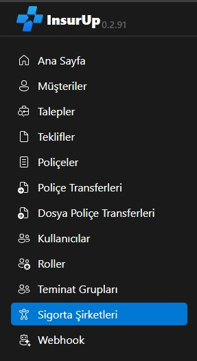
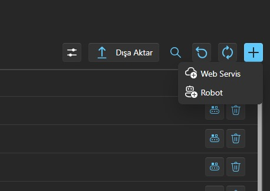
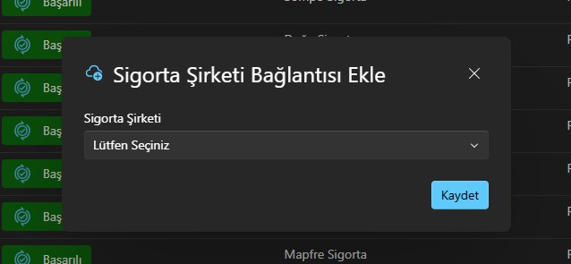
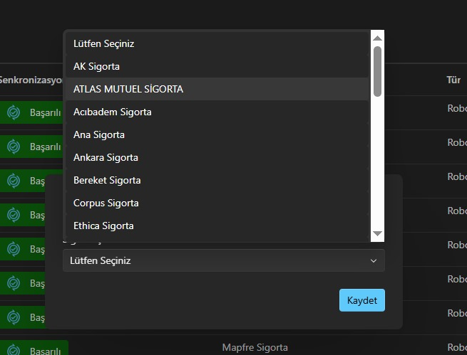
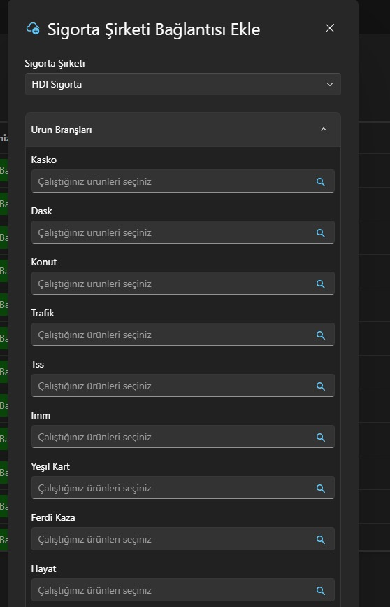
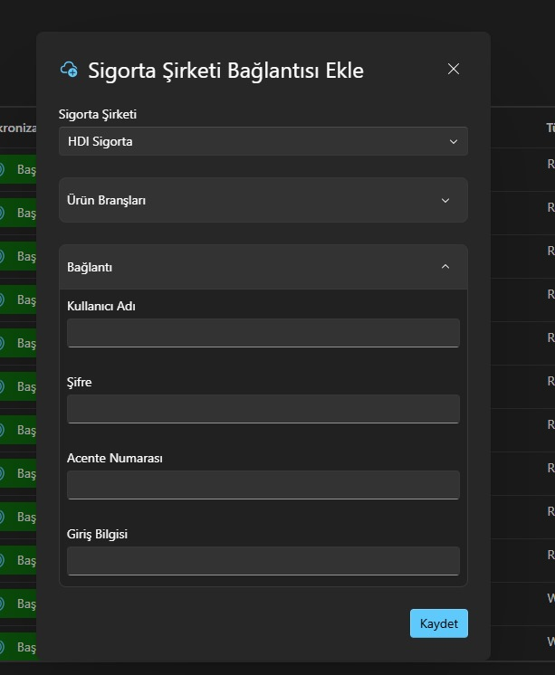

# Web Servis Bağlantı Gereklilikleri

InsurUp'ta web servis entegrasyonu başlatmak için ilgili sigorta şirketinin bölge müdürlüğü veya yetkili BT departmanına resmi talep oluşturulması gerekir. Talep sırasında hangi ürün/servisler için entegrasyon yapılacağının ve bağlantı yetkilerinin belirtilmesi sürecin hızlanmasına yardımcı olur.

Talep sonrasında sigorta şirketiyle web servis sözleşmesi imzalanır ve sözleşme tamamlandıktan sonra şirket, InsurUp sistemine erişimi sağlayacak web servis onaylarını verir. Onay bilgileri ulaştığında InsurUp panelinde `Sigorta Şirketleri` menüsüne gidip sağ üstteki `+` butonuna basarak ilgili şirket için yeni web servis kaydını oluşturabilirsiniz.

Adım adım görsel rehber: 🚀

**1) Sigorta Şirketi sekmesi** 🧭

InsurUp CRM'de sol menüden `Sigorta Şirketleri` sekmesine gidin. Web servis ekleme işlemlerine bu sekmeden başlayacaksınız. ➡️

**2) Web servis ekleme butonu** ➕

Sağ üstteki `+` ikonuna tıklayın ve açılan menüden `Web Servis` seçeneğini seçin. 🖱️

**3) Ekleme pop‑up'ı** 🧾

Karşınıza bu pop‑up çıkacak. Buradan ilgili sigorta şirketini ve ürün/branşı seçip gerekli partaj bilgilerini gireceksiniz. 🛠️

**4) Sigorta şirketi seçimi** 🏢

Açılır menüden entegrasyon yapacağınız sigorta şirketini seçebilirsiniz. 🔽

**5) Ürün / Branş seçimi** 🧩

`Ürün / Branş` alanından çalışacağınız branşları seçin. Seçiminiz, hangi alanların zorunlu olacağı ve teklifleme sürecinde hangi adımların aktifleşeceği üzerinde etkili olacaktır; bu nedenle gerçek iş akışınıza uygun branşları işaretlediğinizden emin olun. 📌

**6) Partaj bilgileri** 🧮

Bu adımda, şirketin istediği partaj alanlarını doldurun. Aşağıdaki tabloda, her sigorta şirketi için hangi bilgilerin gerekli olduğuna dair listeyi bulabilirsiniz. 👇

Aşağıdaki tabloda, sigorta şirketlerinin entegrasyon sırasında genellikle talep ettiği alanları bulabilirsiniz. Bu alanları şirket bazında hazırlayıp ilgili ekiplerle paylaşarak onay sürecini tamamladıktan sonra InsurUp'a eklemeniz gerekir.

| Sigorta şirketleri | Gerekli bağlantılar |
| --- | --- |
| ACIBADEM | Partaj - Acente Numarası |
| AK SİGORTA | Kullanıcı Adı: Şifre: Kanal ID: Şube ID: Token: |
| NEOVA SİGORTA | Kullanıcı Adı: Şifre: Acente Numarası: Şube ID: Satış Kaynağı Kodu: Uygulama Güvenlik Anahtarı: API Anahtarı: |
| NIPPON SİGORTA | Şirketten talep edilmeli |
| AXA SİGORTA | Kullanıcı Adı: Şifre: Acente Numarası: Referans Kullanıcı: |
| ANKARA SİGORTA | Kullanıcı Adı: Şifre: Kanal ID: |
| RAY SİGORTA | Kullanıcı Adı: Şifre: Acente Numarası: Kullanıcı IP: Ortam: |
| DOĞA SİGORTA | Kullanıcı Adı: Şifre: Acente Numarası: |
| ANADOLU SİGORTA | Kullanıcı Adı: Şifre: Acente Numarası: Alt Acente Numarası: Uygulama Gizli Anahtarı: İstemci ID: İstemci Gizli Anahtarı: İstemci IP: |
| HDI SİGORTA | Kullanıcı Adı: Şifre: Acente Numarası: Cient ID: Client Secret: |
| KORU SİGORTA | Kullanıcı Adı: Şifre: Acente Numarası: |
| ZURICH SİGORTA | Acente Numarası: Uygulama ID: |
| TURKIYE SİGORTA | Kullanıcı Adı: Şifre: Satış Kaynağı Kodu: Müşteri Servis URL: Kullanıcı IP: |
| UNICO SİGORTA | Kullanıcı Adı: Şifre: Acente Numarası: Branch Code: Source Code: Uygulama Güvenlik Anahtarı: |
| ALLIANZ SİGORTA | Kullanıcı Adı: Acente Numarası: Alt Acente Numarası: API Anahtarı: |
| SOMPO SİGORTA | Kullanıcı Adı: Şifre: Kanal ID: Kullanıcı IP: İstemci IP: |
| QUICK SİGORTA | İstemci ID: İstemci Secret: |
| TURKIYE KATILIM | Kullanıcı Adı: Şifre: Acente Numarası: |
| BEREKET SİGORTA | Acente Numarası: |
| CORPUS SİGORTA | Şirketten talep edilmeli |
| GULF SİGORTA | Kullanıcı Adı: Şifre: Firma Kodu: İstemci IP: GUID: Kanal ID: |
| MAPFRE SİGORTA | Kullanıcı Adı: Şifre: Acente Numarası: API Anahtarı: İstemci IP: |
| EUREKO SİGORTA | Şirketten talep edilmeli |
| MAGDEBURGER SİGORTA | Kullanıcı Adı: Şifre: Acente Numarası: İstemci ID: İstemci Gizli Anahtarı: |

Bu gereklilikleri toplayıp InsurUp'a tanımladığınızda, ekibiniz ürünleri hızla devreye alabilir ve süreçleri kesintisiz takip edebilir.
