# Robot Agent Uygulama Kullanım Rehberi 🤖

Bu rehber, Robot Agent uygulamasının temel kullanımını ve özelliklerini açıklamaktadır.

## 1. Genel İşlemler 🎛️

### Bağlantı Durumu
Robot Agent uygulamasında bağlantı durumunu kontrol edebilirsiniz:

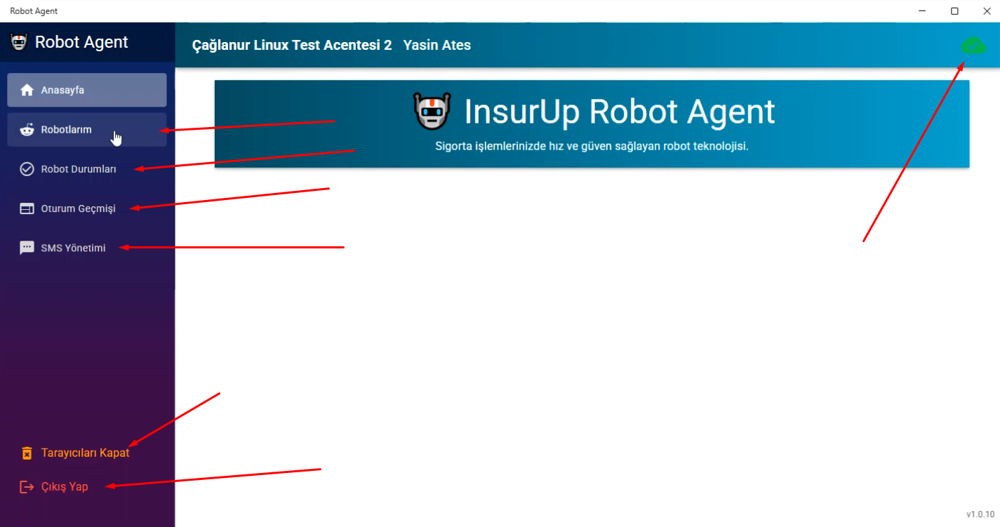

- **🟢 Yeşil simge**: Bağlantı aktif ve çalışıyor.
- **🔴 Kırmızı simge**: Bağlantı kesildi.
  - "Tekrar Bağlan" butonu görünür.
  - Bu butona tıklayarak bağlantıyı yeniden kurun.

### Temel İşlemler
#### Tarayıcıları Kapat
- Kapanmayan Chrome süreçlerini manuel olarak kapatır.
- Sistem kaynaklarını temizler ve performansı artırır.

#### Çıkış Yap
- Kullanıcı oturumunu sonlandırır.
- **Not**: Bu işlem uygulamadan çıkış yapmaz, sadece oturumu kapatır.

#### Uygulamanın Kapatılması
- **X butonuna basma**: Uygulama tray'e küçülür.
- **Tamamen kapatmak için**:
  1. Sistem tray'indeki Robot Agent simgesine sağ tıklayın.
  2. "Kapat" seçeneğini seçin.

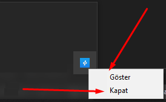

## 2. Robotlarım Sayfası 🤖

### İlk Açılış
- İlk açılışta robot tanımlı değilse uyarı mesajı çıkar.
- Robot ekleme işlemini gerçekleştirmeniz gerekir.

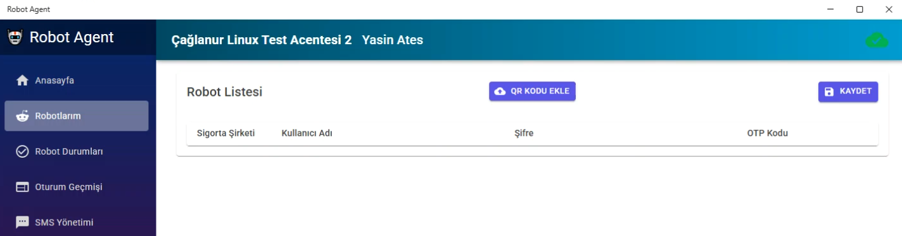

### Robot Ekleme Adımları

#### 1. InsurUp Panelinde Robot Oluşturma
1. **InsurUp panelinde** "Sigorta Şirketleri" bölümüne gidin.
2. **"+"** butonuna tıklayın.

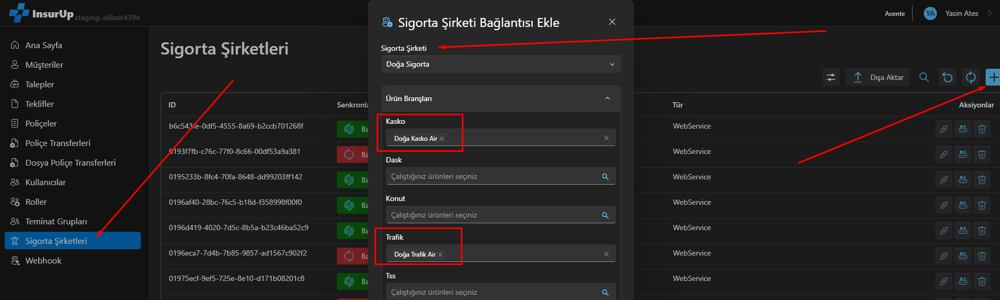

3. **"Robot"** seçeneğini seçin.
4. **Şirket seçin** ve **ürünleri işaretleyin**.

#### 2. Bilgi Girişi
- **Kullanıcı adı**: Sigorta şirketi kullanıcı adınız.
- **Şifre**: Sigorta şirketi şifreniz.
- **Telefon numarası**: Gerekirse telefon numaranız.

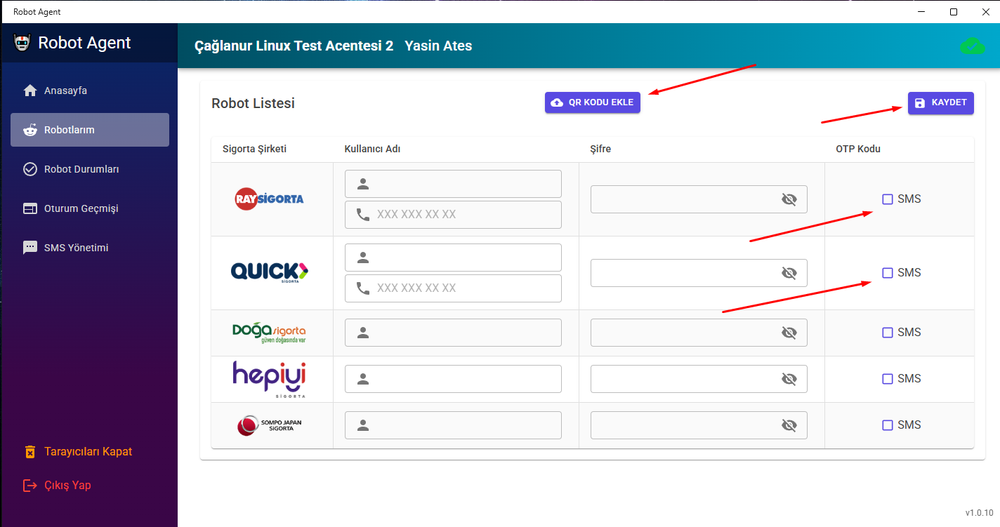

#### 3. OTP Yönetimi
Robot Agent, OTP (One-Time Password) doğrulamasını otomatik olarak yönetir:

- **QR Kod Entegrasyonu**: QR kod ile doğrulama.
- **SMS Doğrulama**: SMS ile doğrulama.
- **QR Kod Yükleme**: QR kod .jpg dosyası yüklenebilir.

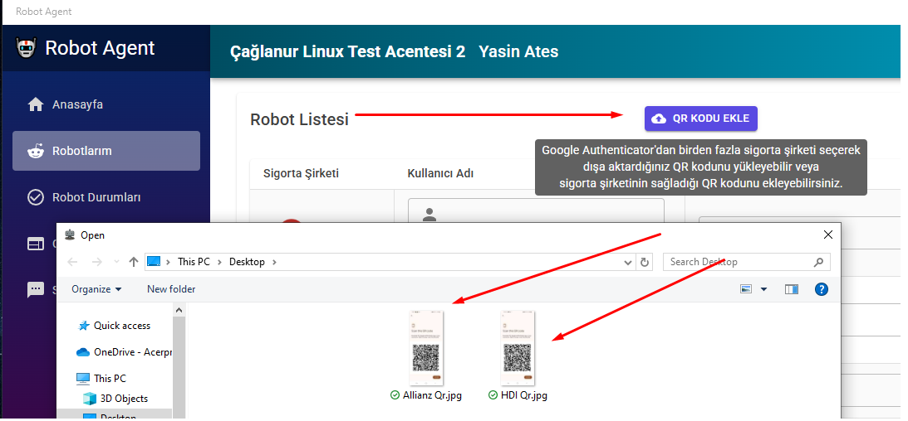

## 3. Robot Durumları 📊

### Otomatik Bağlantı
- OTP ayarları doğru ise sistem **2-3 dakika** içinde otomatik bağlanır.
- Bağlantı durumu gerçek zamanlı olarak takip edilir.

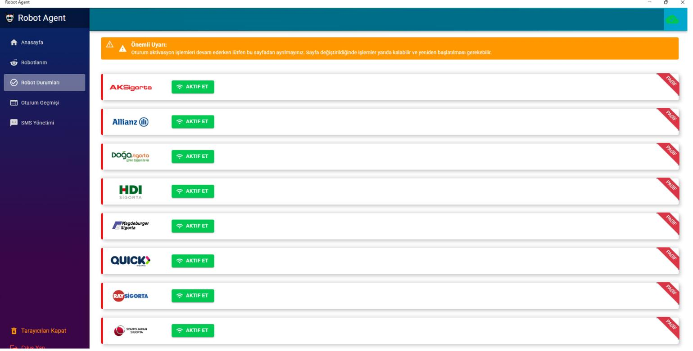

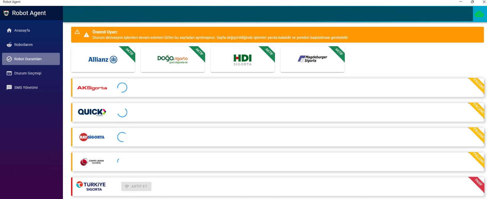

### Hata Yönetimi
- **3 hatalı OTP** denemesinden sonra giriş denemesi durur.
- Manuel müdahale gerekebilir.

### Manuel Aktivasyon
- **"Aktif Et"** butonu ile robotu manuel olarak aktif edebilirsiniz.
- Aynı anda en fazla 4 sigorta şirketi manuel olarak aktif edilebilir.
- Otomatik bağlantı başarısız olduğunda kullanın.

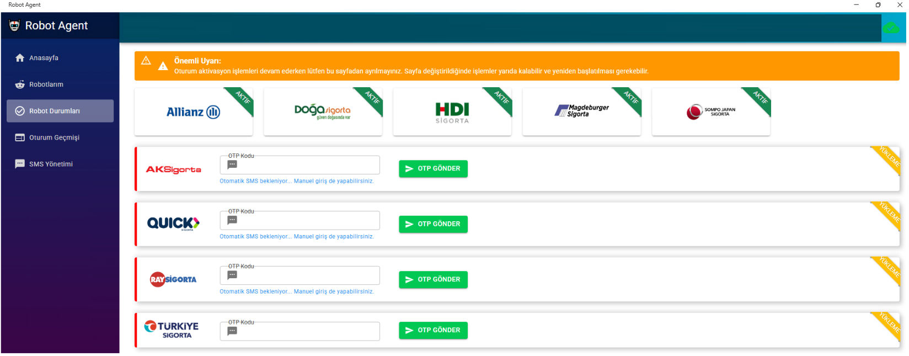

## 4. Oturum Geçmişi 📈

### Otomatik Kontrol
- Sistem **her 6 dakikada bir** oturum kontrolü yapar.
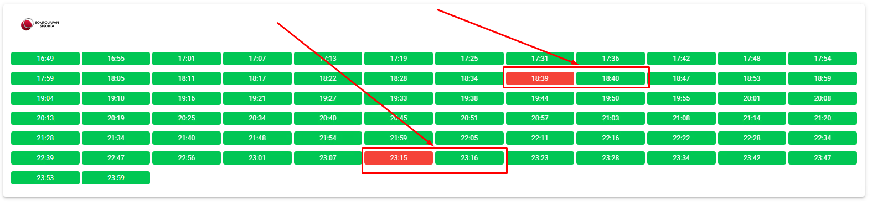

- Bağlantı durumu sürekli izlenir.
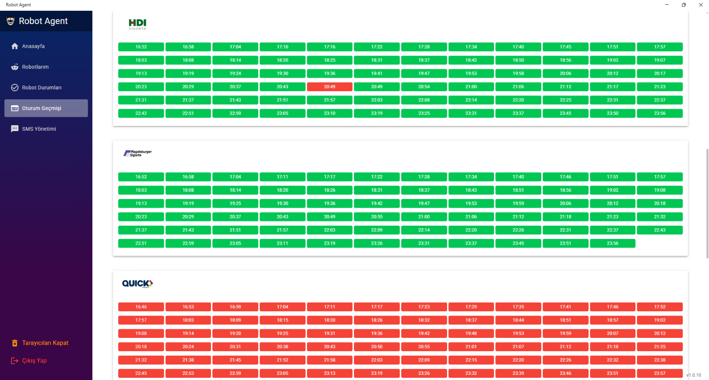

### Şirket Bazlı Süreler
Farklı sigorta şirketleri için oturum süreleri değişir:

- **Ray Sigorta**: 1-2 saat.
- **Doğa Sigorta**: 1 ay ve üzeri.
- Diğer şirketler için farklı süreler olabilir.

## 5. SMS Yönetimi 📱

### Mobil Uygulama Entegrasyonu
- Mobil uygulama QR kod veya aktivasyon kodu ile aktif edilir.
- SMS'ler otomatik olarak aktarılır.

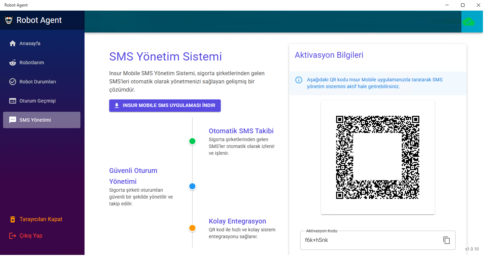

### OTP Süreci
- SMS'lerden gelen OTP kodları otomatik olarak işlenir.
- Manuel müdahale gerektirmez.

## 🔧 İpuçları ve Öneriler

### Performans Optimizasyonu
- Düzenli olarak "Tarayıcıları Kapat" işlemini gerçekleştirin.
- Sistem kaynaklarını temiz tutun.

### Bağlantı Sorunları
- Bağlantı kesildiğinde "Tekrar Bağlan" butonunu kullanın.
- Sorun devam ederse uygulamayı yeniden başlatın.

### Güvenlik
- Aktivasyon kodunuzu güvenli tutun.
- Düzenli olarak şifrelerinizi güncelleyin.

## ❓ Sık Sorulan Sorular

### Robot neden bağlanmıyor?
- OTP ayarlarınızı kontrol edin.
- Sigorta şirketi bilgilerinizin doğru olduğundan emin olun.
- İnternet bağlantınızı kontrol edin.

### SMS'ler gelmiyor mu?
- Telefon numaranızın doğru olduğundan emin olun.
- Mobil uygulama entegrasyonunu kontrol edin.

### Uygulama çalışmıyor mu?
- Uygulamayı yeniden başlatın.
- Sistem gereksinimlerini kontrol edin.

## 📞 Destek

Sorunlarınız için [Destek Ekibi](mailto:destek@insurup.com) ile iletişime geçebilirsiniz.

---

Robot Agent ile otomatik işlemlerinizi kolayca yönetin! 🚀