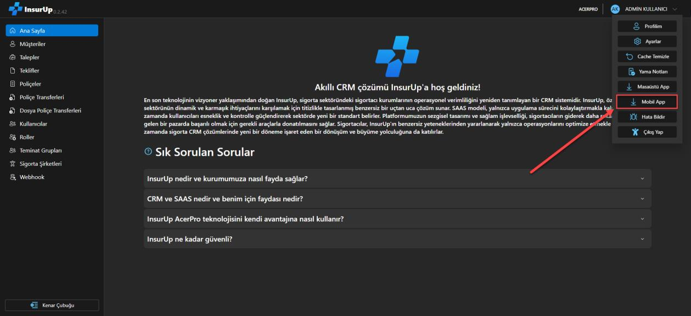
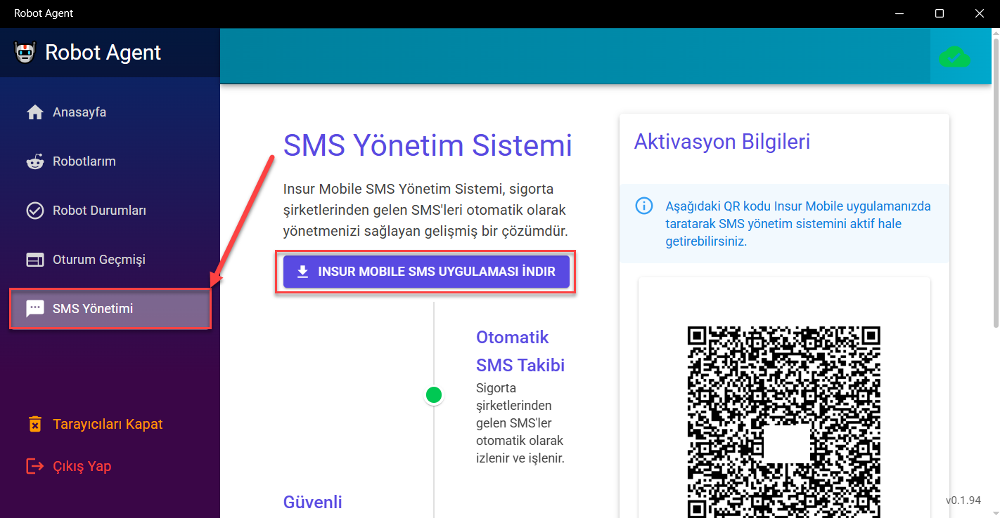
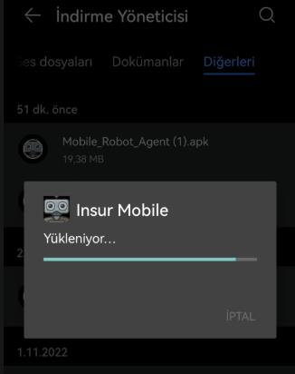
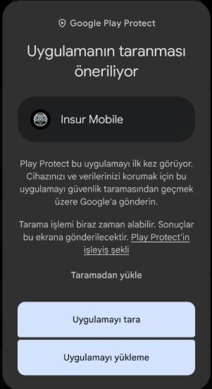
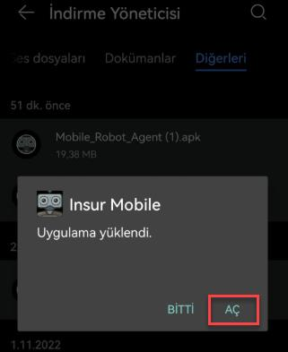
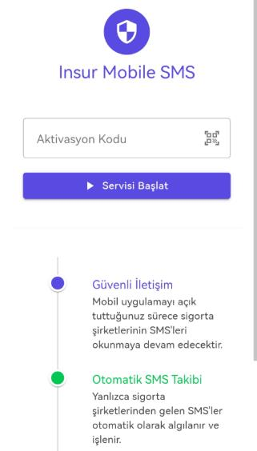
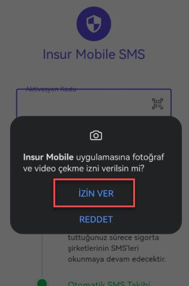
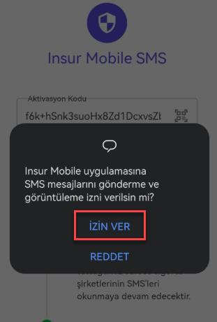
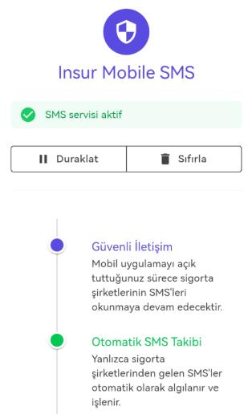
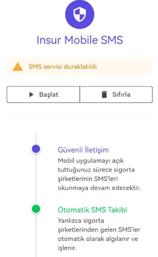

# Mobile Robot Agent Kurulum Rehberi 📱

Bu rehber, **InsurUp Mobile Robot Agent Uygulamasının kurulum ve aktivasyon** süreçlerini adım adım açıklamaktadır. Sorunsuz bir kurulum için lütfen aşağıdaki talimatları dikkatlice takip ediniz.

## Uygulama Hakkında ℹ️

Mobile Robot Agent Uygulaması, robot agent üzerine eklenen **SMS ile aktif olan şirketlerin SMS'lerini** doğrudan uygulamaya entegre etmeye olanak tanır.

### Temel Özellikler
- Yalnızca **sigorta şirketlerinden gelen SMS'leri** okur ve işler; diğer mesajları okumaz veya çekmez.
- Açık kaynaklıdır: [GitHub Linki](https://github.com/InsurUp/MobileRobotAgent)
- Şu an yalnızca **Android cihazlarda** çalışmaktadır. iOS sürümü geliştirilmektedir.
- Uygulama, kurulumdan sonra arka planda **sürekli çalışmalıdır**.
- **Her sabah** uygulamayı kapatıp yeniden başlatmanız gerekir.

> ⚠️ **Önemli**: Eğer uygulamanın SMS çekmediğini düşünüyorsanız, InsurUp ekibi ile iletişime geçiniz.

## 1. Uygulamanın İndirilmesi 📥

### InsurUp Sistemi Üzerinden İndirme
1. **InsurUp sistemine giriş yapın**
   - InsurUp sisteminde sağ üstteki kullanıcı adınıza tıklayın.
   - Açılan menüde **"Mobile Robot Agent"** butonuna tıklayın.
   - Uygulamayı bilgisayarınıza veya telefonunuza indirin.

   

2. **Dosyayı telefona aktarın**
   - Eğer bilgisayara indirdiyseniz, dosyayı kurulum yapılacak telefona aktarın.

### Robot Agent Sistemi Üzerinden İndirme
1. **Robot Agent sistemine giriş yapın**
   - Robot Agent sistemi içinde sol altta **"SMS Yönetimi"** sekmesine girin.
   - **"Insur Mobile SMS Uygulaması İndir"** seçeneğini tıklayın.

   

2. **Dosyayı telefona aktarın**
   - Dosya genelde bilgisayara iner. Kurulum yapılacak telefona aktarmayı unutmayın.

   

## 2. Uygulamanın Kurulumu ⚙️

1. **APK dosyasını bulun**
   - İndirdiğiniz `.apk` dosyasını bulun ve **"Yükle"** seçeneğine tıklayın.

   

2. **Kurulum sürecini bekleyin**
   - "Yükleniyor" ekranındayken çıkmayın. Kurulum birkaç saniyede tamamlanır.

   

3. **Güvenlik uyarısını onaylayın**
   - Google Play Protect tarama uyarısı çıkarsa **"Uygulamayı Tara"** seçeneğini onaylayın.

   

4. **Uygulamayı açın**
   - "Uygulama Yüklendi" ekranı göründüğünde **"Aç"** butonuna tıklayın.

   

## 3. Uygulamanın Aktif Edilmesi 🔧

1. **Aktivasyon ekranını görüntüleyin**
   - Uygulama açıldığında aktivasyon ekranı gelecektir.

   

2. **Aktivasyon kodunu alın**
   - Aktivasyon kodunuzu **Robot Agent → SMS Yönetimi → Aktivasyon Bilgileri** kısmından alın.
   - Alternatif olarak uygulamadaki QR ikonuna tıklayarak Robot Agent'taki QR kodunu okutabilirsiniz.

   

3. **Servisi başlatın**
   - Aktivasyon kodunu girdikten sonra **"Servisi Başlat"** butonuna tıklayın ve gerekli izinleri verin.

    

4. **Durumu kontrol edin**
   - İşlem bittiğinde ana ekranda **"SMS servisi aktif"** mesajı görünecektir.

### Kontrol Butonları
- **Duraklat**: SMS gönderimlerini durdurur.
- **Sıfırla**: Aktivasyon ekranına döner.

5. **Arka planda çalıştırın**
   - Uygulamayı arka planda çalıştırmaya devam edebilirsiniz.

## 4. Önemli Notlar ⚠️

- Uygulamanın **arka planda sürekli çalışması** gerekir.
- Her sabah uygulamayı **yeniden başlatın**.
- Yalnızca sigorta şirketlerinden gelen SMS'ler işlenir.
- Sorun yaşarsanız **InsurUp destek ekibi** ile iletişime geçiniz.

## 5. Destek ve İletişim 📞

Teknik destek için şu adreslerden iletişime geçebilirsiniz:

- 📧 [faruk.altunbicak@acerpro.com.tr](mailto:faruk.altunbicak@acerpro.com.tr)
- 📧 [caglanur.yigit@acerpro.com.tr](mailto:caglanur.yigit@acerpro.com.tr)
- 📧 [brokerpro@acerpro.com.tr](mailto:brokerpro@acerpro.com.tr)
